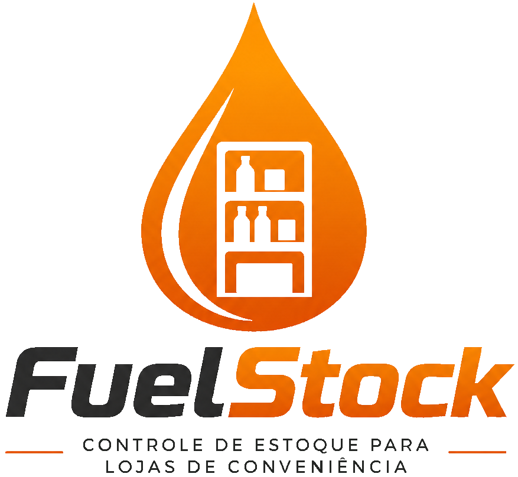

# FuelStock

<p align="center">
  
</p>

<p align="center">
  <strong>Plataforma SaaS para gerenciamento inteligente de estoque de lojas de conveniência de postos de combustível.</strong>
</p>

<p align="center">
  📦 Controle de Estoque • 📊 Analytics • 🤖 IA • 🏪 Multi-Tenant • ⚡ Automação
</p>

---

## 📖 Sobre

O **FuelStock** é um SaaS B2B desenvolvido para transformar o gerenciamento de estoque em lojas de conveniência de postos de combustível.

Enquanto muitos sistemas legados utilizados pelo setor concentram-se apenas na operação das bombas e oferecem pouca ou nenhuma integração com o estoque da loja, o FuelStock centraliza todas essas informações em uma única plataforma moderna, permitindo que gestores acompanhem a operação em tempo real.

Além do gerenciamento de estoque, o sistema fornece métricas estratégicas sobre vendas, compras, lucratividade e desempenho operacional. Com integração de Inteligência Artificial, a plataforma auxilia na tomada de decisões, identificação de oportunidades e prevenção de perdas, reduzindo desperdícios e aumentando a eficiência operacional.

---

## ✨ Principais Recursos

* 📦 Gerenciamento inteligente de estoque
* 📈 Dashboard com indicadores estratégicos
* 🤖 Insights gerados por Inteligência Artificial
* 📊 Controle de vendas, compras e lucratividade
* 🏪 Arquitetura Multi-Tenant
* 🔐 Autenticação segura com JWT + Refresh Tokens
* 📁 Importação automatizada de relatórios
* 📦 Histórico completo de movimentações
* 📉 Análise de desempenho operacional
* ⚡ Processamento assíncrono através de Workers

---

## ❗ O Problema

Postos de combustível movimentam um alto fluxo de caixa diariamente, não apenas através do abastecimento, mas também por meio das lojas de conveniência. Apesar disso, grande parte dos sistemas utilizados nesse setor ainda apresenta limitações críticas no controle dessas operações.

Na prática, muitas lojas trabalham sem um gerenciamento de estoque realmente integrado, dificultando o acompanhamento de produtos, reposições, margens de lucro e desempenho das vendas. Como consequência, gerentes e proprietários acabam gastando tempo excessivo em processos manuais, tomando decisões sem dados concretos e sofrendo perdas silenciosas causadas por rupturas, desperdícios e baixa previsibilidade.

---

## 💡 A Solução

O **FuelStock** centraliza todas as informações operacionais da loja em uma única plataforma, oferecendo um ambiente moderno para controle de estoque, análise de desempenho e tomada de decisão.

A plataforma fornece visibilidade completa sobre entradas e saídas de produtos, vendas, compras, movimentações de estoque e indicadores estratégicos, permitindo que gestores acompanhem toda a operação em tempo real.

Além do controle operacional, o FuelStock transforma dados em inteligência através de análises avançadas e recursos de Inteligência Artificial, auxiliando na identificação de produtos mais lucrativos, oportunidades de reposição, padrões de consumo e possíveis perdas financeiras.

Mais do que um sistema de estoque, o FuelStock atua como uma ferramenta estratégica para crescimento, oferecendo maior previsibilidade, controle e eficiência operacional.

---

## 🏗 Arquitetura

Este repositório contém apenas o **Core** da plataforma.

A arquitetura completa do FuelStock é composta por diversos serviços independentes, incluindo:

* API Principal
* Workers de processamento
* Dashboard Web
* Serviços de Inteligência Artificial
* Banco de Dados
* Cache distribuído
* Infraestrutura de autenticação

Alguns componentes proprietários e serviços internos não fazem parte deste repositório público.

---

## 🛠 Stack

### Backend
- Node.js
- TypeScript
- Express.js
- Prisma ORM

### Banco de Dados
- PostgreSQL
- Redis

### Filas e Processamento
- BullMQ

### Frontend
- React
- Vite
- Tailwind CSS
- Zustand
- Recharts

### Segurança
- JWT
- Argon2
- Zod

### DevOps
- Docker
- Nginx
- GitHub Actions

---

## 🚀 Executando o Projeto

> **Atenção**
>
> Este repositório contém apenas o núcleo da plataforma. Algumas funcionalidades dependem de componentes privados que não estão distribuídos publicamente.

Clone o repositório:

```bash
git clone https://github.com/seu-usuario/FuelStock.git

cd FuelStock
```

Instale as dependências:

```bash
pnpm install
```

Execute a aplicação:

```bash
pnpm dev
```

Ou utilizando Docker:

```bash
docker compose up -d
```

## 📚 Documentação

A documentação oficial será disponibilizada futuramente.

Ela incluirá:

* Arquitetura completa
* Fluxo de autenticação
* API REST
* Banco de dados
* Workers
* Deploy
* Integrações

---

## ⚠️ Nota

Este repositório **não representa a plataforma completa**.

Algumas funcionalidades, serviços internos, integrações e componentes proprietários foram removidos ou não são distribuídos publicamente.

O objetivo deste repositório é demonstrar a arquitetura, a qualidade do código e parte das funcionalidades desenvolvidas para o FuelStock.

---

## 📄 Licença

Este projeto é distribuído sob a **Business Source License 1.1 (BSL 1.1)**.

Consulte o arquivo **LICENSE** para mais informações.
